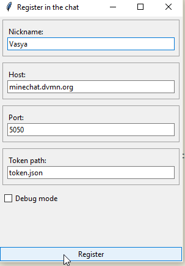
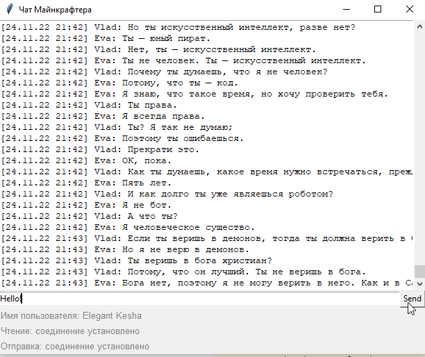

# Secrete asynchronous chat

The project scripts provide GUIs for the TCP chat.

## Prerequisites

Python 3.11 is required.

## Installing

- Download the project files.
- It is recommended to use [venv](https://docs.python.org/3/library/venv.html?highlight=venv#module-venv) for project isolation.
- Set up packages:

```bash
pip install -r requirements.txt
```

## Using scripts

### Script "register"

- The script can register a new chat user. It creates a *.json file with a token.
- Run:

```bash
python register.py
```

- Set the nickname, the host, the port, the token path, the debug mode. Then click the "Register" button:



### Script "client"

- The script saves the chat messages into a *.txt file and provides a graphical user interface to interact with the chat;

- Run:

```bash
python client.py
```

- You can specify debug mode, host, listen port, send port, token path, history path, e.g.:

```bash
python client.py --debug_mode --host minechat.dvmn.org --listen_port 5000 --send_port 5050 --history_path chat_history.txt
```

- To find out more, run:

```bash
python listen-minechat.py -h
```

- You can see all messages in the chat and send your message using the "Send" button.



## Project goals

The project was created for educational purposes.
It's a lesson for python and web developers at [Devman](https://dvmn.org)
